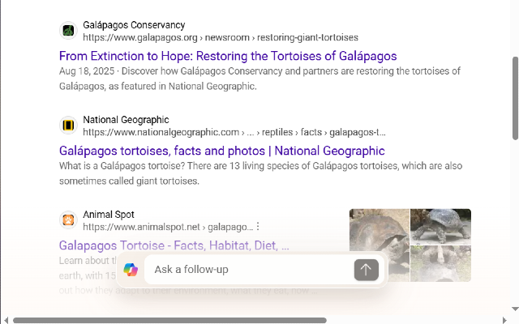
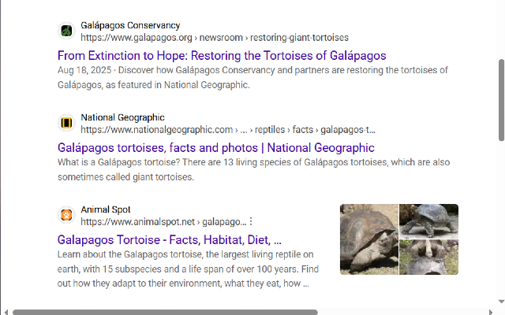

# Bing Results Page Customizer
A Microsoft Edge extension that lets you toggle the visibility of the Copilot follow-up footer panel on Bing search results.

## Features
- Hide or show the Copilot follow-up section with one click to regain browser space
- Saves your preference automatically
- Lightweight and private — no tracking or data collection

## Installation (Developer Mode)
1. Clone this repo or download as ZIP (and unzip it).
2. Go to `edge://extensions/` in Microsoft Edge.
3. Enable **Developer mode**.
4. Click **Load unpacked** and select the project folder.

## Preview
### Without Extension
  

### With Extension
  

## License
This project is licensed under the MIT License - see the [LICENSE](LICENSE) file for details.
